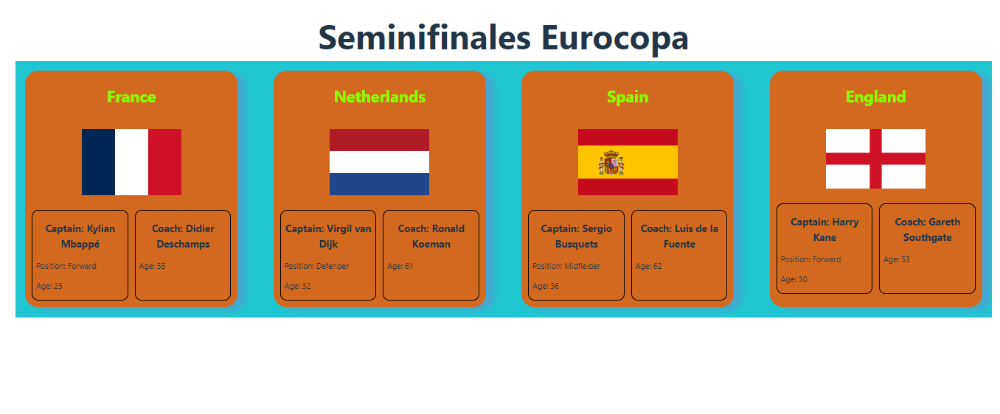

# Proyecto




## Pasos 

### 1. Se creó el array de objetos
``` ts
export const COUNTRIES = [
    {
        name: 'France',
        image: 'https://upload.wikimedia.org/wikipedia/en/c/c3/Flag_of_France.svg',
        soccerCaptain: {
            name: 'Kylian Mbappé',
            position: 'Forward',
            age: 25,
        },
        coach: {
            name: 'Didier Deschamps',
            age: 55
        }    
    },
    {
        name: 'Netherlands',
        image: 'https://upload.wikimedia.org/wikipedia/commons/2/20/Flag_of_the_Netherlands.svg',
        soccerCaptain: {
            name: 'Virgil van Dijk',
            position: 'Defender',
            age: 32,
        },
        coach: {
            name: 'Ronald Koeman',
            age: 61
        }    
    },
    {
        name: 'Spain',
        image: 'https://upload.wikimedia.org/wikipedia/en/9/9a/Flag_of_Spain.svg',
        soccerCaptain: {
            name: 'Sergio Busquets',
            position: 'Midfielder',
            age: 36,
        },
        coach: {
            name: 'Luis de la Fuente',
            age: 62
        }    
    },
    {
        name: 'England',
        image: 'https://upload.wikimedia.org/wikipedia/en/b/be/Flag_of_England.svg',
        soccerCaptain: {
            name: 'Harry Kane',
            position: 'Forward',
            age: 30,
        },
        coach: {
            name: 'Gareth Southgate',
            age: 53
        }    
    }
];
```

### 2. Se creó los tipos de datos
```ts
export interface SoccerCaptain {
    name: string;
    position: string;
    age: number
}


export interface Coach {
    name: string;
    age: number
}

export interface Country {
    name: string;
    image: string;
    soccerCaptain: SoccerCaptain;
    coach: Coach;
}

```

### 3. Se crearon los componentes para el contenedor del listado de los paises y el card de país

```ts
import { Country } from "../types/countries"
import './CountryCard.css'
interface CountryCardProps  {
    country: Country
}

export const CountryCard = ({country}: CountryCardProps) => {
    return (
        <article className="countryContainer">
            <h2 className="countryName">{country.name}</h2>
            
            <div className="infoContainer">
                <div className="aditionalInfo">
                    <h3 className="titleInfo">Captain: {country.soccerCaptain.name}</h3>
                    <p>Position: {country.soccerCaptain.position}</p>
                    <p>Age: {country.soccerCaptain.age}</p>
                </div>
                <div className="aditionalInfo">
                    <h3 className="titleInfo">Coach: {country.coach.name}</h3>
                    <p>Age: {country.coach.age}</p>
                </div>
            </div>

        </article>
    )
}
```

```ts
import { COUNTRIES } from "../constants/countries"
import { CountryCard } from "../countryCard"
import './CountryList.css'
export const CountryList = () => {
    return (
        <section className="container">
            {COUNTRIES.map(country => {
                return (
                    <CountryCard key={country.name} country={country} />
                )
            })}
        </section>
    )
}
```

así quedaría la distribución de carpetas


